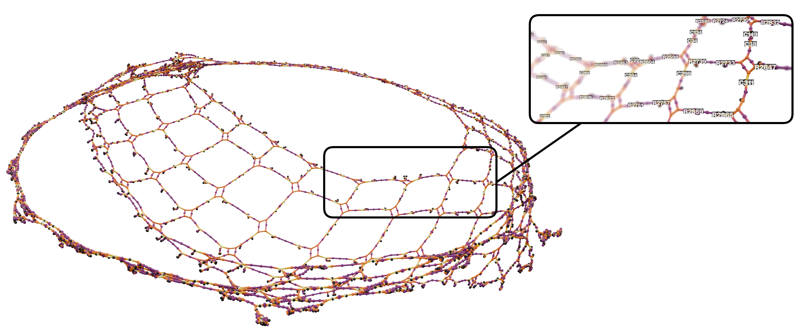
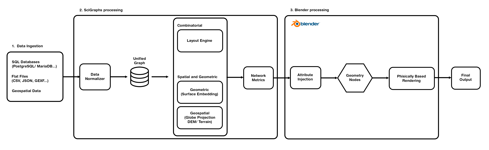
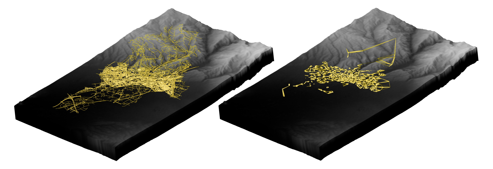

# SciGraphs

[](https://github.com/SciBlend/SciGraphs/actions)
[](https://extensions.blender.org/)
[](https://www.gnu.org/licenses/gpl-3.0)

[](https://github.com/SciBlend/SciGraphs/releases/download/v1.0.0/scigraphs-1.0.0-linux_x64.zip)
[](https://github.com/SciBlend/SciGraphs/releases/download/v1.0.0/scigraphs-1.0.0-windows_x64.zip)
[](https://github.com/SciBlend/SciGraphs/releases/download/v1.0.0/scigraphs-1.0.0-macos_x64.zip)
[](https://github.com/SciBlend/SciGraphs/releases/download/v1.0.0/scigraphs-1.0.0-macos_arm64.zip)

<picture>
  <source media="(prefers-color-scheme: dark)" srcset="./images/scigraphs-favicon.png">
  <source media="(prefers-color-scheme: light)" srcset="./images/scigraphs-favicon-dark.png">
  
</picture>

**SciGraphs** is an open-source extension that embeds scientific graph processing directly within the modern 3D graphics environment of Blender. It turns abstract networks and real-world spatial graphs into native Blender objects driven by Geometry Nodes, mapping analytical results (centralities, communities, topological invariants) to named attributes that procedurally drive color, scale, and animation — combining the analytical power of NetworkX, igraph and Graphviz with Blender's Cycles & EEVEE path-traced rendering.

SciGraphs supports two complementary domains:

- **Combinatorial graphs**, where classical network metrics, community structure, and algorithmic layouts are computed and mapped procedurally via attribute-driven properties.
- **Spatial and geometric graphs**, where networks are visualized using their intrinsic coordinate data (geospatial, sparse-matrix, mesh) or laid out via topological analysis, including multi-layer urban morphologies through the City2Graph module.

By unifying network analysis and visualization within Blender, SciGraphs enables reproducible 3D visualizations that extend network-geometry communication beyond the constraints of traditional 2D canvases (Gephi, Cytoscape, Graphia...).



> *A 3D finite-element-mesh graph (5,425 nodes / 5,872 edges) from the SuiteSparse Matrix Collection, laid out with Yifan Hu (SFDP) and colored by betweenness centrality (Inferno colormap), rendered in Cycles with depth-of-field and adaptive labels.*

## Install

### Manual Installation from GitHub Release

1. Download the platform zip above for your system
2. Open Blender > Edit > Preferences > Add-ons
3. Select "Install from Disk", then choose the downloaded zip
4. Enable the SciGraphs add-on in case it's not active

### Development Version

To install the latest development version:

1. Go to GitHub Actions: https://github.com/SciBlend/SciGraphs/actions
2. Select the latest successful workflow run
3. Download the artifact for your platform
4. Extract the downloaded zip to get the actual extension zip file
5. Install manually following the steps above

### Build from Source

```bash
git clone https://github.com/SciBlend/SciGraphs.git
cd SciGraphs
./scripts/fetch_wheels.sh   # download bundled dependency wheels for all platforms
./build_extension.sh        # build per-platform zips and install for your OS
```

The bundled dependency wheels are **not** tracked in git, so `scripts/fetch_wheels.sh` must be run first to populate the `wheels/` directory (it downloads the Python 3.13 wheels for every platform from the `constraints/` files). Then `build_extension.sh` uses Blender's `extension build --split-platforms` command to produce per-platform zips in `dist/` and installs the one matching your OS.

After enabling, open **View3D > Sidebar > SciGraphs**.

## 🧩 Components included

- **Data Import**: GEXF, SuiteSparse Matrix Collection (`.mtx`), CSV edge lists and node-attribute tables, and live SQL databases (PostgreSQL, MySQL/MariaDB, SQLite; SQL Server optional). Supports temporal graph sequences with playback controls.
- **OSMnx Street Networks**: download by place, address, bounding box, point + radius, polygon or local `.osm` XML; routing and shortest paths, accessibility, edge speeds & travel times, centrality, bearings and orientation (rose diagrams), plus elevation/terrain (DEM) and basemap texturing.
- **City2Graph (Urban Morphology & Transport)**: Overture Maps import (buildings, places, segments, connectors, land, water), morphological graphs (tessellation + private/public relations), proximity graphs, and GTFS transit analysis (DuckDB-backed) with travel-summary and origin–destination graphs and metapaths.
- **Layouts**: force-directed (NetworkX spring, igraph Fruchterman–Reingold, Kamada–Kawai, DrL, LGL, Davidson–Harel, Graphopt, ForceAtlas2, and Yifan Hu via Graphviz), spectral (graph-Laplacian eigenvectors), classical MDS, Circle Packing for planar graphs (Collins–Stephenson), geometric 3D distributions (Fibonacci sphere, helix, spiral, cube), and directed/hierarchical layouts (Sugiyama layered, circular hierarchy). Graphviz engines (dot, neato, fdp, sfdp, twopi, circo, osage, patchwork) run via the bundled `scigraphs-utils` bindings. A *Network Splitter* decomposes layouts into Z-layers by community, degree, centrality or component.
- **Analysis**: centrality for undirected (degree, betweenness, closeness, eigenvector) and directed graphs (PageRank, HITS hub/authority, in/out-degree, Katz); community detection with seven SurpriseMe algorithms (CPM, Infomap, RB, RN, RNSC, SCluster, UVCluster) and the **Surprise** quality metric via the bundled `pysurprise` bindings; directed-structure detection (DAG/tree/forest, SCC/WCC, cycles, sources/sinks/bottlenecks), BFS/DFS traversal and flow animation; and topological analysis (Boyer–Myrvold planarity, Euler characteristic, Kuratowski subgraphs, genus bound).
- **Visualization**: Geometry-Nodes rendering of nodes (instanced primitives) and edges (tubes/curves), attribute-driven coloring with scientific colormaps, attribute-driven node/edge sizing, edge-style presets (Gephi, Cytoscape, Schematic, Bundled, Flow, Minimal), interactive gizmos/toolbar and text-overlay labels.
- **Reproducible Pipelines**: declarative JSON/YAML workflow specifications with deterministic seeding and provenance manifests.
- **Export**: GEXF, GraphML, JSON, CSV edge lists, Pajek `.net`, node positions and statistics reports, plus a conversion script for PyTorch Geometric structures.

## ⚙️ Requirements

- **Blender 5.1.0+**
- Bundled Python wheels target **Python 3.13** (the interpreter shipped with Blender 5.1.x)
- Platforms: Linux x64, Windows x64, macOS x64, macOS ARM64
- Internet access is required for geospatial features (geocoding, OSM networks, maps, DEM) and SQL database connections

All third-party dependencies are bundled as wheels — no manual `pip install` is needed. Key dependencies include `networkx`, `igraph`, `rustworkx`, `osmnx`, `city2graph`, `overturemaps`, `geopandas`, `shapely`, `pyproj`, `momepy`, `libpysal`, `scikit-learn`, `scipy`, `pandas`, `pyarrow`, `duckdb`, `pillow` and `requests`.

## 🌐 External Data Sources & APIs

SciGraphs integrates several open and commercial data services:

| Source | Used for | Access |
| --- | --- | --- |
| OpenStreetMap / Nominatim | Street networks and geocoding (via OSMnx & geopy) | Public |
| Overture Maps | Buildings, places, segments, connectors, land, water | Public (cloud parquet) |
| OpenTopography / OpenTopoData | Digital Elevation Models (SRTM, etc.) | API key / public |
| Open-Elevation | Point elevation queries | Public |
| OSM / ESRI / Mapbox tiles | Basemap texturing of terrain | Public / token |
| NASA Blue Marble | Globe satellite imagery for geospatial scenes | Public |
| Natural Earth | Land/ocean vector context layers | Public |
| SuiteSparse Matrix Collection | Benchmark sparse-matrix graphs | Public |
| GTFS feeds | Public-transport networks | User-provided |

The native bindings that power the Graphviz layouts (`scigraphs-utils`) and the Surprise community-detection metric (`pysurprise`) are **built and maintained by the project author**, José Marín.

## 🔁 Reproducible Workflows

SciGraphs can replay an entire pipeline — dataset, analysis, layout, visualization, render and export — from a short declarative JSON or YAML file:

```json
{
  "meta": { "title": "complex_demo", "seed": 42 },
  "dataset": { "source": "osmnx", "method": "PLACE", "query": "Burjassot, Valencia, Spain", "network_type": "drive" },
  "analysis": { "metrics": ["degree", "betweenness"] },
  "layout": { "algorithm": "YIFAN_HU", "scale": 8.0 },
  "visual": { "node_color": "betweenness", "node_size": "degree", "colormap": "magma", "edge_style": "GEPHI_DEFAULT" }
}
```

Each run emits a canonical specification, a provenance manifest (with input/output hashes and timing) and an execution log, so the same seed and inputs reproduce the same result. See [`examples/pipelines/`](./examples/pipelines) for ready-to-run pipelines and the full schema reference.

## 🔄 Workflow Overview



The pipeline transforms raw data into high-fidelity 3D visualizations. Data-ingestion modules normalize inputs from diverse sources (flat files, SQL databases, geospatial data) into a unified internal representation. The processing core bifurcates into two analytical domains — *combinatorial* (layouts and network metrics) and *spatial/geometric* (geometry-driven embeddings and geospatial morphology) — and Blender's Geometry Nodes and Cycles engine convert these analytical structures into procedural geometry and photorealistic renders.

1. **Import or Generate** a graph: load a file/database, download an OSMnx network, build an urban morphology graph, or pull a SuiteSparse matrix.
2. **Analyze**: compute centrality, community structure, statistics and topology; results are stored as mesh attributes on the graph object.
3. **Lay Out**: arrange nodes with any of the 2D/3D, force-directed or Graphviz layout algorithms.
4. **Visualize**: set up Geometry Nodes, then drive node/edge color and size from attributes using scientific colormaps and edge-style presets.
5. **Render & Export**: render with Cycles or EEVEE, and export the graph (GEXF, GraphML, JSON, CSV, Pajek), positions, or statistics reports.

## 🖼️ Gallery

| | |
| --- | --- |
|  |  |
| **Global migration flows (2000–2016).** UNHCR displacement data (188 country nodes, 3,614 weighted edges) projected onto a 3D globe with geodesic arcs and NASA imagery, rendered in Cycles. | **Granada, Spain.** A 37,814-intersection street network plus a 20-NN amenity proximity graph (city2graph) draped onto SRTM 30 m terrain. |


> *Gallery of six SuiteSparse matrices laid out with Yifan Hu's multilevel algorithm; node color encodes eigenvector centrality (Black-Body Radiation colormap).*


## 📜 Citing SciGraphs

SciGraphs is described in:

> **SciGraphs: Graph Visualization and Analysis within Blender.**
> José Marín, Ignacio Marín, Ignacio García-Fernández.
> CoMMLab, Universitat de València; Instituto de Biomedicina de Valencia (IBV-CSIC).

If SciGraphs is used in research or publications, please cite it:

```
@software{scigraphs,
  author    = {José Marín and Ignacio Marín and Ignacio García-Fernández},
  title     = {SciGraphs: Graph Visualization and Analysis within Blender},
  publisher = {GitHub},
  url       = {https://github.com/SciBlend/SciGraphs},
  note      = {Open-source add-on for Blender 5.1+},
  year      = {2025}
}
```

**Keywords:** scientific visualization, Blender, data rendering, graph theory.

(Source code: https://github.com/SciBlend/SciGraphs)

## 🤝 Contributions

Contributions to SciGraphs are welcome, including issue reporting, feature suggestions and pull requests. Please use the [issue tracker](https://github.com/SciBlend/SciGraphs/issues) in this repository.

## 💬 Support & Contact

For inquiries or support:

- Maintainer: José Marín — `jose.marin-farina@uv.es`
- Issues: https://github.com/SciBlend/SciGraphs/issues

## 📄 License

SciGraphs is released under the **GNU General Public License v3.0 or later (GPL-3.0-or-later)**.

---
