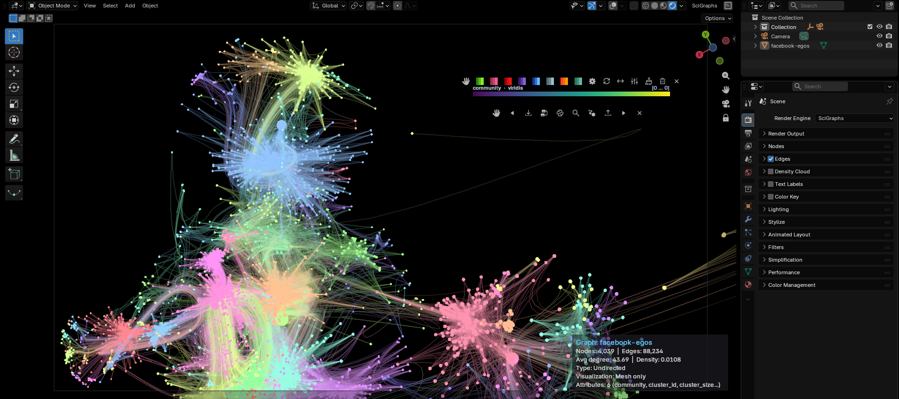
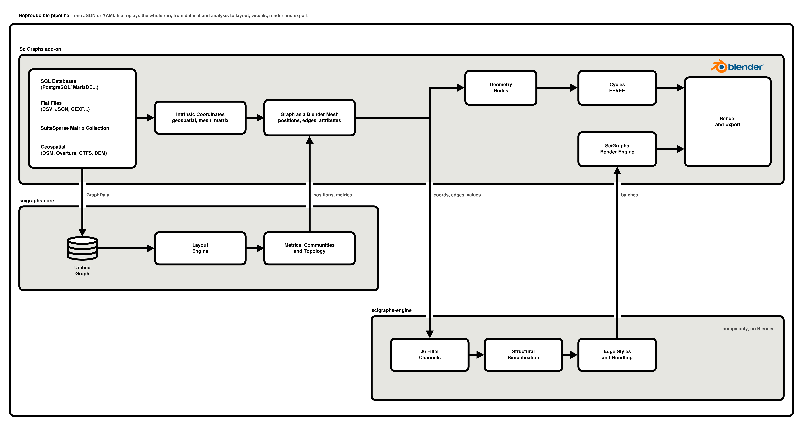
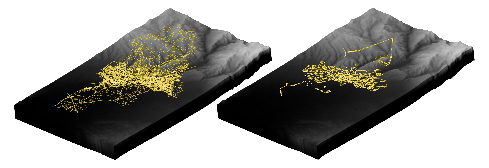

# SciGraphs

[](https://github.com/SciBlend/SciGraphs/actions)
[](https://extensions.blender.org/add-ons/scigraphs/)
[](https://www.gnu.org/licenses/gpl-3.0)

[](https://github.com/SciBlend/SciGraphs/actions/runs/26736494851/artifacts/7323866319)
[](https://github.com/SciBlend/SciGraphs/actions/runs/26736494851/artifacts/7323866601)
[](https://github.com/SciBlend/SciGraphs/actions/runs/26736494851/artifacts/7323866870)

<picture>
  <source media="(prefers-color-scheme: dark)" srcset="./images/sciblend-favicon.png">
  <source media="(prefers-color-scheme: light)" srcset="./images/sciblend-favicon-dark.png">
  
</picture>

**SciGraphs** is an open-source extension that embeds scientific graph processing directly within the modern 3D graphics environment of Blender. It turns abstract networks and real-world spatial graphs into native Blender objects, mapping analytical results (centralities, communities, topological invariants) to named attributes that drive color, scale, and animation — combining the analytical power of NetworkX, igraph and Graphviz with two ways of drawing the result: Geometry Nodes for Cycles and EEVEE, or the project's own GPU render engine.

SciGraphs supports two complementary domains:

- **Combinatorial graphs**, where classical network metrics, community structure, and algorithmic layouts are computed and mapped procedurally via attribute-driven properties.
- **Spatial and geometric graphs**, where networks are visualized using their intrinsic coordinate data (geospatial, sparse-matrix, mesh) or laid out via topological analysis, including multi-layer urban morphologies through the City2Graph module.

By unifying network analysis and visualization within Blender, SciGraphs enables reproducible 3D visualizations that extend network-geometry communication beyond the constraints of traditional 2D canvases.


> ***facebook-egos, 4,039 nodes and 88,234 edges,** drawn by the SciGraphs render engine in the viewport, colored by community.*

## Install

### From the Blender Extensions platform

[](https://extensions.blender.org/add-ons/scigraphs/)

The shortest route, and the one that keeps itself updated. In Blender, open
**Edit > Preferences > Get Extensions**, search for *SciGraphs* and install it.
Later versions arrive through that same panel.

### From a GitHub release

For a specific build, or one newer than the platform is serving:

1. Download the platform zip above for your system
2. Open Blender > Edit > Preferences > Add-ons
3. Select "Install from Disk", then choose the downloaded zip
4. Enable the SciGraphs add-on in case it's not active

### Development Version

To install the latest development version:

1. Go to GitHub Actions: https://github.com/SciBlend/SciGraphs/actions
2. Select the latest successful workflow run
3. Download the artifact for your platform
4. Extract the downloaded zip to get the actual extension zip file
5. Install manually following the steps above

### Build from Source

```bash
git clone https://github.com/SciBlend/SciGraphs.git
cd SciGraphs
./scripts/fetch_wheels.sh   # download bundled dependency wheels for all platforms
./build_extension.sh        # build per-platform zips and install for your OS
```

The bundled dependency wheels are **not** tracked in git, so `scripts/fetch_wheels.sh` must be run first to populate the `wheels/` directory (it downloads the Python 3.13 wheels for every platform from the `constraints/` files). Then `build_extension.sh` uses Blender's `extension build --split-platforms` command to produce per-platform zips in `dist/` and installs the one matching your OS.

After enabling, open **View3D > Sidebar > SciGraphs**.

## Architecture

The project ships as three pieces that version independently:

- [`core/`](core/) is `scigraphs-core`: algorithms, layouts, colormaps, OSM and geo helpers, and the pipeline schema.
- [`engine/`](engine/) is `scigraphs-engine`: coordinates and an edge list go in, geometry or pixels come out, with 26 filter channels, structural sparsification, edge-style tessellation and hierarchical bundling in between.
- The add-on owns what needs Blender: mesh building, scene I/O, the panels, and the GPU render engine.

Neither library imports `bpy`, and the compute half of the engine needs only numpy, so both run in a plain Python session and install from PyPI. The add-on depends on them; neither depends on the add-on.

<picture>
  <source media="(prefers-color-scheme: dark)" srcset="./images/workflow_architecture_dark.png">
  <source media="(prefers-color-scheme: light)" srcset="./images/workflow_architecture.png">
  
</picture>

> *One lane per distribution. `core` and `engine` never import each other, so every hop between lanes starts or ends in the add-on, and each one is labeled with what actually crosses.*

## Components included

- **Data Import**: GEXF, SuiteSparse Matrix Collection (`.mtx`), CSV edge lists and node-attribute tables, and live SQL databases (PostgreSQL, MySQL/MariaDB, SQLite; SQL Server optional). A time column can aggregate the import or restrict it to a range.
- **OSMnx Street Networks**: download by place, address, bounding box, point + radius, polygon or local `.osm` XML; routing and shortest paths, accessibility, edge speeds & travel times, centrality, bearings and orientation (rose diagrams), plus elevation/terrain (DEM) and basemap texturing.
- **City2Graph (Urban Morphology & Transport)**: Overture Maps import (buildings, places, segments, connectors, land, water), morphological graphs (tessellation + private/public relations), proximity graphs, and GTFS transit analysis (DuckDB-backed) with travel-summary and origin–destination graphs and metapaths.
- **Layouts**: force-directed (NetworkX spring, igraph Fruchterman–Reingold, Kamada–Kawai, DrL, LGL, Davidson–Harel, Graphopt, ForceAtlas2, Yifan Hu), spectral (graph-Laplacian eigenvectors), classical MDS, Circle Packing for planar graphs (Collins–Stephenson), geometric 3D distributions (Fibonacci sphere, helix, spiral, cube), and directed/hierarchical layouts (Sugiyama layered, circular hierarchy). Graphviz engines (dot, neato, fdp, sfdp, twopi, circo, osage, patchwork) run via the bundled `scigraphs-utils` bindings. Every algorithm reports the backend it used and any fallback it took, so Circle Packing says whether the circles came out tangent. A *Network Splitter* decomposes layouts into Z-layers by community, degree, centrality, component or a custom expression. A layout can also be simulated frame by frame, its positions held in a GPU texture so playback never rebuilds the mesh.
- **Analysis**: centrality for undirected (degree, betweenness, closeness, eigenvector) and directed graphs (PageRank, HITS hub/authority, in/out-degree, Katz), computed through igraph or rustworkx where they are available and NetworkX otherwise; community detection with seven SurpriseMe algorithms (CPM, Infomap, RB, RN, RNSC, SCluster, UVCluster) and the **Surprise** quality metric via the bundled `pysurprise` bindings; directed-structure detection (DAG/tree/forest, SCC/WCC, cycles, sources/sinks/bottlenecks), BFS/DFS traversal and flow animation; and topological analysis (Boyer–Myrvold planarity, Euler characteristic, Kuratowski subgraphs, genus bound, 3D edge crossings).
- **Visualization**: Geometry-Nodes rendering of nodes (instanced primitives) and edges (tubes/curves), attribute-driven coloring with scientific colormaps, node and edge sizing that each read their own attribute, edge-style presets (Gephi, Cytoscape, Schematic, Bundled, Flow, Minimal), interactive gizmos/toolbar and text-overlay labels.
- **SciGraphs render engine**: a third engine beside Cycles and EEVEE, drawing from GPU buffers instead of instanced geometry, so it stays interactive at millions of elements. Nodes are sphere or ribbon impostors, edge styles are tessellated in GLSL, and the level of detail is chosen in pixels rather than distance. It carries the filter stack, structural simplification, hierarchical bundling, stylised shading, depth of field, a density cloud, and viewport overlays for the color key, labels, a reference grid and the node under the cursor.
- **Reproducible Pipelines**: declarative JSON/YAML workflow specifications with deterministic seeding and provenance manifests.
- **Export**: GEXF, GraphML, JSON, CSV edge lists, Pajek `.net`, node positions and statistics reports, plus a conversion script for PyTorch Geometric structures.

## Requirements

- **Blender 5.1.0+**
- Bundled Python wheels target **Python 3.13** (the interpreter shipped with Blender 5.1.x)
- Platforms: Linux x64, Windows x64, macOS ARM64 (Apple Silicon)
- Internet access is required for geospatial features (geocoding, OSM networks, maps, DEM) and SQL database connections

All third-party dependencies are bundled as wheels — no manual `pip install` is needed. Key dependencies include `networkx`, `igraph`, `rustworkx`, `osmnx`, `city2graph`, `overturemaps`, `geopandas`, `shapely`, `pyproj`, `momepy`, `libpysal`, `scikit-learn`, `scipy`, `pandas`, `pyarrow`, `duckdb`, `pillow` and `requests`.

## External Data Sources & APIs

SciGraphs integrates several open and commercial data services:

| Source | Used for | Access |
| --- | --- | --- |
| OpenStreetMap / Nominatim | Street networks and geocoding (via OSMnx & geopy) | Public |
| Overture Maps | Buildings, places, segments, connectors, land, water | Public (cloud parquet) |
| OpenTopography / OpenTopoData | Digital Elevation Models (SRTM, etc.) | API key / public |
| Open-Elevation | Point elevation queries | Public |
| OSM / ESRI / Mapbox tiles | Basemap texturing of terrain | Public / token |
| NASA Blue Marble | Globe satellite imagery for geospatial scenes | Public |
| Natural Earth | Land/ocean vector context layers | Public |
| SuiteSparse Matrix Collection | Benchmark sparse-matrix graphs | Public |
| GTFS feeds | Public-transport networks | User-provided |

The native bindings that power the Graphviz layouts (`scigraphs-utils`) and the Surprise community-detection metric (`pysurprise`) are **built and maintained by the project author**, José Marín.

## Reproducible Workflows

SciGraphs can replay an entire pipeline — dataset, analysis, layout, visualization, render and export — from a short declarative JSON or YAML file:

```json
{
  "meta": {
    "title": "fig3_suitesparse_nemsafm",
    "seed": 42,
    "output_dir": "//repro/fig3_suitesparse",
    "description": "SuiteSparse ingestion. A rectangular linear-programming constraint matrix read as a bipartite graph and laid out with the multilevel force-directed method the collection itself uses for its gallery.",
    "clear_scene": true
  },
  "dataset": { "source": "suitesparse", "matrix_name": "Meszaros/nemsafm" },
  "analysis": { "metrics": ["degree", "betweenness"] },
  "layout": { "algorithm": "YIFAN_HU", "scale": 8.0, "iterations": 200 },
  "visual": {
    "setup_geometry_nodes": true,
    "node_color": "degree", "colormap": "cividis", "color_norm": "RANK",
    "node_glyph": "ICOSPHERE", "node_resolution": 12,
    "node_radius_rel": 0.0035, "edge_radius_rel": 0.0011, "edge_resolution": 8,
    "material_roughness": 0.35, "edge_base_color": [0.2, 0.2, 0.24, 1.0]
  },
  "world": { "color": [0.03, 0.03, 0.04], "strength": 1.0 },
  "lighting": { "sun_energy": 3.0, "sun_angle": 180.0, "replace": true },
  "render": {
    "engine": "CYCLES", "resolution": [1920, 1080], "samples": 96,
    "output": "figure.png", "denoise": true, "view_transform": "Standard",
    "filter_width": 1.0, "camera_lens": 50.0, "camera_margin": 1.04,
    "camera_direction": [0.0, 0.0, 1.0]
  },
  "exports": { "statistics": "stats.json" }
}
```

This is the specification behind the SuiteSparse figure in the docs, [reproducible pipelines](https://sciblend.github.io/SciGraphs/examples/05-reproducible-pipeline.html), where the same file is downloadable and the figure it produces is shown next to it.

## Workflow Overview

1. **Import or Generate** a graph: load a file/database, download an OSMnx network, build an urban morphology graph, or pull a SuiteSparse matrix.
2. **Analyze**: compute centrality, community structure, statistics and topology; results are stored as mesh attributes on the graph object.
3. **Lay Out**: arrange nodes with any of the 2D/3D, force-directed or Graphviz layout algorithms.
4. **Visualize**: drive node and edge color and size from those attributes, using scientific colormaps and edge-style presets, through Geometry Nodes or the GPU engine.
5. **Render & Export**: render with Cycles, EEVEE or the SciGraphs engine, and export the graph (GEXF, GraphML, JSON, CSV, Pajek), positions, or statistics reports.

## Gallery

| | |
| --- | --- |
|  |  |
| **Global migration flows (2000–2016).** UNHCR displacement data (188 country nodes, 3,614 weighted edges) projected onto a 3D globe with geodesic arcs and NASA imagery, rendered in Cycles. | **Granada, Spain.** A 37,814-intersection street network plus a 20-NN amenity proximity graph (city2graph) draped onto SRTM 30 m terrain. |


## Citing SciGraphs

SciGraphs is described in:

> **Visualization and Analysis of Graphs with SciGraphs.**
> José Marín, Ignacio Marín, Ignacio García-Fernández.
> The Eurographics Association, 2026.

If SciGraphs is used in research or publications, please cite it:

```
@article{marin2026visualization,
  title={Visualization and Analysis of Graphs with SciGraphs},
  author={Mar{\'\i}n, Jos{\'e} and Mar{\'\i}n, Ignacio and Garc{\'\i}a-Fern{\'a}ndez, Ignacio},
  year={2026},
  publisher={The Eurographics Association}
}
```

(Source code: https://github.com/SciBlend/SciGraphs)

## Contributions

Contributions to SciGraphs are welcome, including issue reporting, feature suggestions and pull requests. Please use the [issue tracker](https://github.com/SciBlend/SciGraphs/issues) in this repository.

## Support & Contact

For inquiries or support:

- Maintainer: José Marín — `jose.marin-farina@uv.es`
- Issues: https://github.com/SciBlend/SciGraphs/issues

## License

The add-on is released under the **GNU General Public License v3.0 or later**
([`LICENSE`](LICENSE)), which is what Blender's extensions platform requires.

The two libraries described under [Architecture](#architecture) ship separately
under **MIT**, so they can be used without Blender and without taking on the
GPL.

[`LICENSES.md`](LICENSES.md) explains the split and covers the bundled
third-party wheels.


