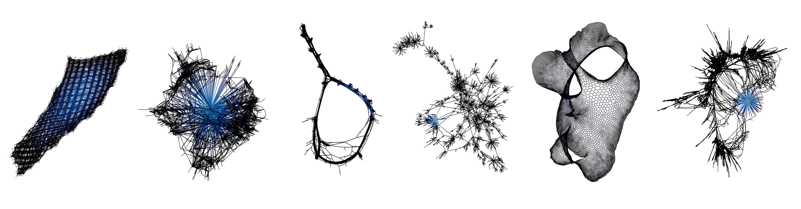

::: {.lead}
Import a benchmark matrix from the SuiteSparse Matrix Collection, lay it out (or
use its intrinsic coordinates), and colour it by eigenvector centrality — the
recipe behind the sparse-matrix gallery in the SciGraphs paper.
:::

The SuiteSparse Matrix Collection contains over 2,800 sparse matrices from
real-world applications (finite-element meshes, circuit simulations,
optimization problems, and more), making it an excellent benchmark corpus.

## 1. Import a matrix

1. Open **SciGraphs ▸ [Data](../panels/scigraphs/data.qmd)** and set the source
   to **SuiteSparse**.
2. Enter a **Matrix Identifier** in `Group/Name` form (e.g. `Grund/bayer09`). Use
   **Browse Collection** to find identifiers.
3. Choose the **Graph Representation**:
   - **Symmetric** — interprets the matrix as a standard adjacency graph via
     $A + A^\top$ (denser, rounder layouts).
   - **Bipartite** — treats rows and columns as two disjoint node sets,
     preserving the original matrix structure (elongated layouts).
4. Enable **Giant component only** to keep just the largest connected component.
5. Optionally enable **Auto layout on import** and pick **Yifan Hu** as the
   default layout.
6. Press **Download & Create Graph**.

::: {.callout-note}
If the archive ships an auxiliary coordinate file, SciGraphs applies those
coordinates directly as vertex positions and **skips the layout entirely**,
faithfully reproducing the geometry of the underlying physical domain.
:::

## 2. Lay out (matrices without coordinates)

For matrices without coordinate data, open
**[Layout & Positioning](../panels/scigraphs/layout.qmd)** and apply **Yifan Hu
(sfdp)** in 3D — it typically produces the most informative results for large
sparse structures.

## 3. Colour by eigenvector centrality

1. Run **Setup Visual** (Data panel, Step 4) if you have not already.
2. In **[Analysis ▸ Centrality Metrics](../panels/scigraphs/analysis.qmd#centrality)**,
   choose **eigenvector** and press **Calculate**.
3. In the **[Visualization panel](../panels/scigraphs/visualization.qmd)**, map
   node colour to the eigenvector-centrality attribute using a colormap such as
   **Inferno** or **Black-Body Radiation**. Bright nodes mark the vertices most
   central to the dominant eigenstructure; dark regions are peripheral.

## 4. Render

Add lighting and a camera, then render with Cycles. For dense meshes, depth of
field and adaptive text labels (label only high-degree nodes via the
**Attribute Filter**) reduce visual clutter and reinforce depth perception.

## Building a gallery

Repeat the import for several identifiers spanning different problem domains to
assemble a morphological gallery, then arrange the resulting objects in a single
scene for a comparative figure.
