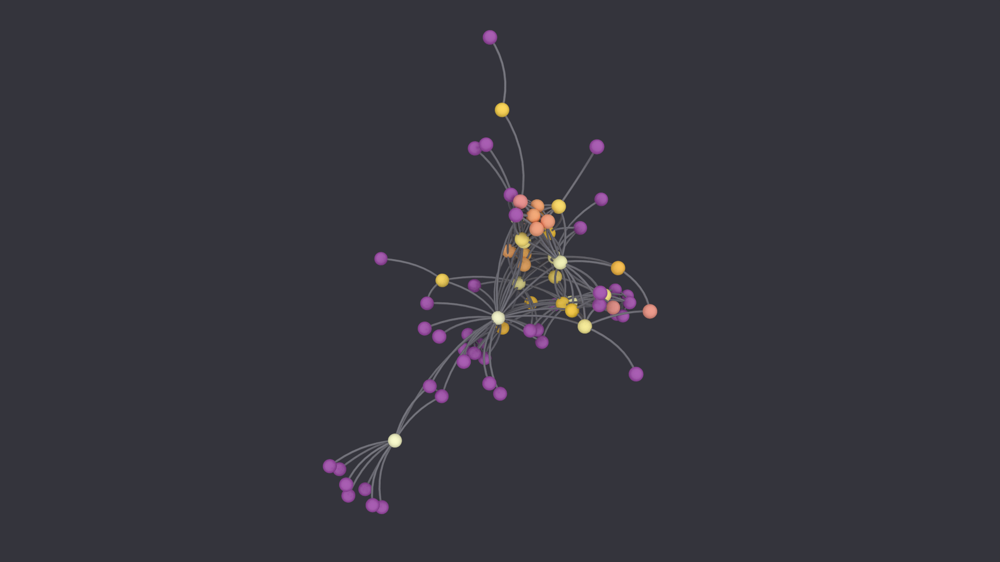
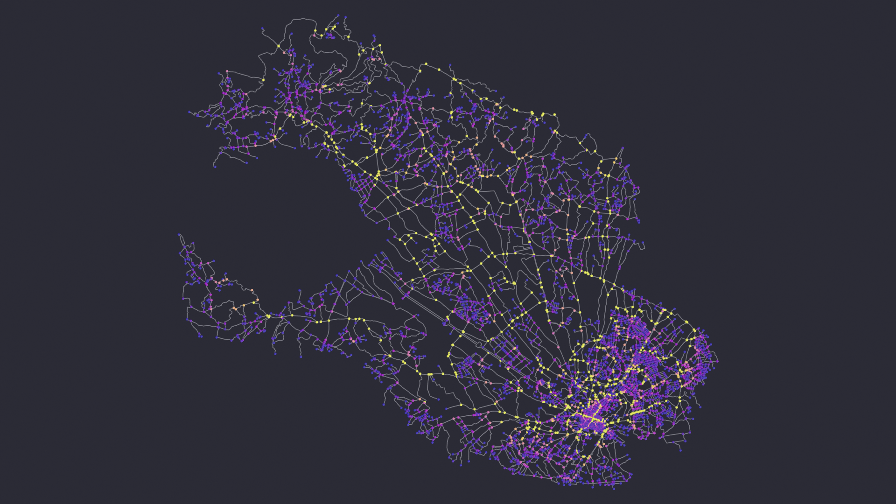
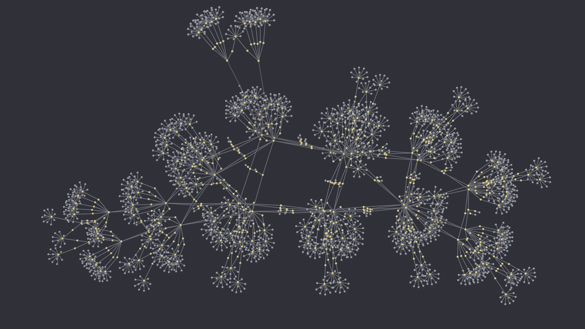
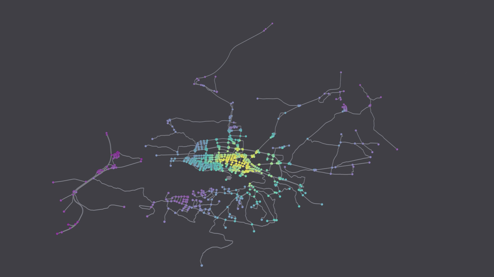
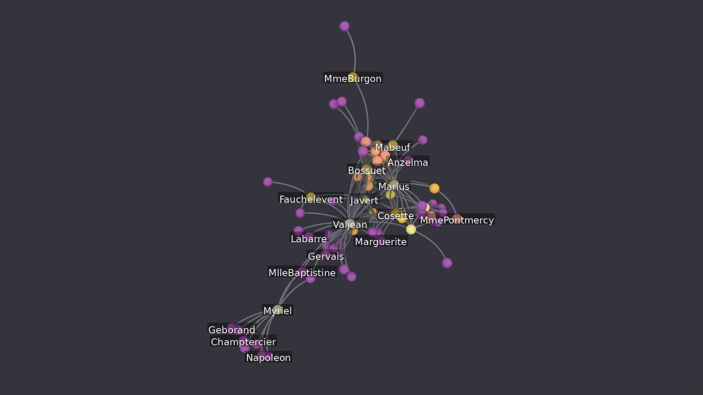

::: {.lead}
Capture an entire workflow — dataset, analysis, layout, styling, lighting,
labels, render and export — in a short declarative file, then replay it
deterministically with a provenance manifest.
:::

A pipeline specification is a JSON or YAML file with one block per stage of the
workflow. Running it reproduces the whole figure: the same `seed` and the same
inputs give the same result, on any machine with the add-on installed. Each run
also writes a manifest recording the versions it used and a SHA-256 for every
file it produced, so a third party can check that they got what you got.

That turns a figure into something you can put in a repository — a few kilobytes
of text that regenerates the image, instead of a screenshot and a paragraph
describing which buttons were pressed.

## Ready-to-run specifications

The specifications below are complete and self-contained: each produces the
figure shown beside it, with no editing. They are not fragments to adapt — they
run as they are. Each card explains what it demonstrates and why its fields are
set the way they are, so the collection doubles as a tour of the schema.

**Download one, then drag it from your file manager onto the 3D Viewport.** With
SciGraphs enabled it runs immediately, writing its outputs and a provenance
manifest beside the file. Nothing else needs to be open.

You can also set the **Pipeline file** in
**SciGraphs ▸ [Reproducibility](../panels/scigraphs/reproducibility.qmd)** and
press **Validate**, then **Run**.

## From a terminal, without opening Blender

A specification is a batch job, so it does not need a window. This runs one
headlessly and needs nothing but Blender with SciGraphs installed:

```bash
blender -b --python-expr "import bpy; bpy.ops.scigraphs.run_pipeline(filepath='/path/to/spec.json')"
```

Outputs and the manifest land beside the specification exactly as they would
from the interface. Progress goes to stdout, prefixed `[SciGraphs Repro]`.

For scripting or continuous integration, exit on the operator's result so a
failure stops the build instead of passing silently:

```bash
blender -b --python-expr "import bpy, sys; sys.exit(0 if 'FINISHED' in bpy.ops.scigraphs.run_pipeline(filepath=sys.argv[-1]) else 1)" -- /path/to/spec.json
```

Blender itself exits 0 whatever happens inside the script, so the `sys.exit` is
what makes a broken specification visible. Everything after `--` is passed to
the script rather than interpreted by Blender.

This is also the way to regenerate a set of figures: loop over the
specifications and let each one write its own manifest, then compare the digests
against the ones recorded previously.

::: {.callout-note}
Paths beginning `//` resolve against the folder holding the specification, so
keep a downloaded file next to any data it references. Two of these download a
street network live from OpenStreetMap; the rest need no network.
:::


## Les Misérables from a GEXF file

::: {.gallery-tagline}
Rank normalization on a betweenness distribution that is half zeros
:::

{.gallery-figure}

The co-appearance network of *Les Misérables*: 77 characters, 254 edges,
distributed with the specification so the example runs with no network access.

Betweenness here is extreme even by the standards of social networks. **43 of the
77 characters have betweenness exactly zero** — they appear only alongside
someone more central — and the maximum, Valjean, reaches 0.57. Normalized
linearly onto a colormap, 71 of 77 nodes fall in the lowest tenth and only 5 of
10 color bins are used at all.

`color_norm: RANK` replaces each value by its position in the sorted order. The
bins become 8, 8, 7, 8, 7, 8, 8, 7, 8, 8 — uniform by construction. That is what
the figure shows.

The limit is visible too: the 43 tied zeros share one rank, so they share one
color. Ranking fixes the distribution, not the ties.

| | |
| --- | --- |
| **Source** | `gexf` — lesmiserables.gexf |
| **Engine** | Cycles |
| **Color transform** | `RANK` |
| **Metrics** | `degree`, `betweenness` |
| **Sections** | `meta` · `dataset` · `analysis` · `layout` · `visual` · `world` · `lighting` · `render` · `exports` |

::: {.gallery-actions}
<a class="download-spec" download="fig1_flatfile_lesmiserables.json" href="data:application/json;base64,ewogICJtZXRhIjogewogICAgInRpdGxlIjogImZpZzFfZmxhdGZpbGVfbGVzbWlzZXJhYmxlcyIsCiAgICAic2VlZCI6IDQyLAogICAgIm91dHB1dF9kaXIiOiAiLy9yZXByby9maWcxX2ZsYXRmaWxlIiwKICAgICJkZXNjcmlwdGlvbiI6ICJGbGF0LWZpbGUgaW5nZXN0aW9uIChHRVhGKS4gRGVtb25zdHJhdGVzIHJhbmsgbm9ybWFsaXphdGlvbjogYmV0d2Vlbm5lc3Mgb24gdGhpcyBncmFwaCBpcyBoZWF2eS10YWlsZWQsIGFuZCBhIGxpbmVhciByYW1wIHdvdWxkIHB1dCBhbG1vc3QgZXZlcnkgbm9kZSBpbiB0aGUgZGFya2VzdCBjb2xvci4iLAogICAgImNsZWFyX3NjZW5lIjogdHJ1ZQogIH0sCiAgImRhdGFzZXQiOiB7CiAgICAic291cmNlIjogImdleGYiLAogICAgImZpbGVwYXRoIjogIi8vZGF0YS9sZXNtaXNlcmFibGVzLmdleGYiLAogICAgImF1dG9fbGF5b3V0IjogZmFsc2UKICB9LAogICJhbmFseXNpcyI6IHsKICAgICJtZXRyaWNzIjogWwogICAgICAiZGVncmVlIiwKICAgICAgImJldHdlZW5uZXNzIgogICAgXQogIH0sCiAgImxheW91dCI6IHsKICAgICJhbGdvcml0aG0iOiAiU1BSSU5HXzNEIiwKICAgICJzY2FsZSI6IDUuMCwKICAgICJpdGVyYXRpb25zIjogMTUwCiAgfSwKICAidmlzdWFsIjogewogICAgInNldHVwX2dlb21ldHJ5X25vZGVzIjogdHJ1ZSwKICAgICJub2RlX2NvbG9yIjogImJldHdlZW5uZXNzIiwKICAgICJjb2xvcm1hcCI6ICJpbmZlcm5vIiwKICAgICJjb2xvcl9ub3JtIjogIlJBTksiLAogICAgIm5vZGVfZ2x5cGgiOiAiSUNPU1BIRVJFIiwKICAgICJub2RlX3Jlc29sdXRpb24iOiAyNCwKICAgICJub2RlX3NoYWRlX3Ntb290aCI6IHRydWUsCiAgICAibm9kZV9yYWRpdXNfcmVsIjogMC4wMjIsCiAgICAiZWRnZV9yYWRpdXNfcmVsIjogMC4wMDM1LAogICAgImVkZ2VfcmVzb2x1dGlvbiI6IDEyLAogICAgImVkZ2Vfc3R5bGUiOiAiQ1lUT1NDQVBFX0JFWklFUiIsCiAgICAibWF0ZXJpYWxfcm91Z2huZXNzIjogMC4zNSwKICAgICJtYXRlcmlhbF9tZXRhbGxpYyI6IDAuMCwKICAgICJlZGdlX2Jhc2VfY29sb3IiOiBbCiAgICAgIDAuMTYsCiAgICAgIDAuMTYsCiAgICAgIDAuMTksCiAgICAgIDEuMAogICAgXQogIH0sCiAgIndvcmxkIjogewogICAgImNvbG9yIjogWwogICAgICAwLjAzNSwKICAgICAgMC4wMzUsCiAgICAgIDAuMDQ1CiAgICBdLAogICAgInN0cmVuZ3RoIjogMS4wCiAgfSwKICAibGlnaHRpbmciOiB7CiAgICAic3VuX2VuZXJneSI6IDMuMCwKICAgICJzdW5fYW5nbGUiOiAxODAuMCwKICAgICJyZXBsYWNlIjogdHJ1ZQogIH0sCiAgInJlbmRlciI6IHsKICAgICJlbmdpbmUiOiAiQ1lDTEVTIiwKICAgICJyZXNvbHV0aW9uIjogWwogICAgICAxOTIwLAogICAgICAxMDgwCiAgICBdLAogICAgInNhbXBsZXMiOiA5NiwKICAgICJvdXRwdXQiOiAiZmlndXJlLnBuZyIsCiAgICAiZGVub2lzZSI6IHRydWUsCiAgICAidmlld190cmFuc2Zvcm0iOiAiU3RhbmRhcmQiLAogICAgImZpbHRlcl93aWR0aCI6IDEuMCwKICAgICJjYW1lcmFfbGVucyI6IDYwLjAsCiAgICAiY2FtZXJhX21hcmdpbiI6IDEuMTIsCiAgICAiY29sb3JfZGVwdGgiOiAiMTYiCiAgfSwKICAiZXhwb3J0cyI6IHsKICAgICJwb3NpdGlvbnMiOiAicG9zaXRpb25zLmNzdiIKICB9Cn0=">Download fig1_flatfile_lesmiserables.json</a>
:::

::: {.callout-note collapse="true"}
## The specification: `fig1_flatfile_lesmiserables.json`

```json
{
  "meta": {
    "title": "fig1_flatfile_lesmiserables",
    "seed": 42,
    "output_dir": "//repro/fig1_flatfile",
    "description": "Flat-file ingestion (GEXF). Demonstrates rank normalization: betweenness on this graph is heavy-tailed, and a linear ramp would put almost every node in the darkest color.",
    "clear_scene": true
  },
  "dataset": {
    "source": "gexf",
    "filepath": "//data/lesmiserables.gexf",
    "auto_layout": false
  },
  "analysis": {
    "metrics": [
      "degree",
      "betweenness"
    ]
  },
  "layout": {
    "algorithm": "SPRING_3D",
    "scale": 5.0,
    "iterations": 150
  },
  "visual": {
    "setup_geometry_nodes": true,
    "node_color": "betweenness",
    "colormap": "inferno",
    "color_norm": "RANK",
    "node_glyph": "ICOSPHERE",
    "node_resolution": 24,
    "node_shade_smooth": true,
    "node_radius_rel": 0.022,
    "edge_radius_rel": 0.0035,
    "edge_resolution": 12,
    "edge_style": "CYTOSCAPE_BEZIER",
    "material_roughness": 0.35,
    "material_metallic": 0.0,
    "edge_base_color": [
      0.16,
      0.16,
      0.19,
      1.0
    ]
  },
  "world": {
    "color": [
      0.035,
      0.035,
      0.045
    ],
    "strength": 1.0
  },
  "lighting": {
    "sun_energy": 3.0,
    "sun_angle": 180.0,
    "replace": true
  },
  "render": {
    "engine": "CYCLES",
    "resolution": [
      1920,
      1080
    ],
    "samples": 96,
    "output": "figure.png",
    "denoise": true,
    "view_transform": "Standard",
    "filter_width": 1.0,
    "camera_lens": 60.0,
    "camera_margin": 1.12,
    "color_depth": "16"
  },
  "exports": {
    "positions": "positions.csv"
  }
}
```
:::

## Llíria street network, orthographic

::: {.gallery-tagline}
Choosing a color transform by measuring what it does to the histogram
:::

{.gallery-figure}

The walkable street network of Llíria (Valencia, about 23,000 inhabitants):
6037 nodes, 8067 edges, downloaded live from OpenStreetMap. There is no `layout`
block on purpose — the coordinates arrive with the data, and a force-directed
layout would discard the geography.

`camera_ortho` removes the near/far size falloff, so a node radius that encodes a
value stays comparable anywhere in the frame. The cost is the loss of depth cues,
a fair trade for a network that is essentially flat.

Betweenness here is extremely concentrated: median 0.001 against a maximum of
0.26, with 1112 nodes at exactly zero. Choosing how to map that onto a colormap
is the interesting decision, and it is one you can measure rather than guess.
Counting how many nodes each transform sends into the brightest three tenths of
the ramp:

| `color_norm` | Ramp bins used | Nodes in the brightest 30 % |
| --- | --- | --- |
| `LINEAR` | 9 of 10 | 8 (0.1 %) |
| `LINEAR`, clipped at the 99th percentile | 10 of 10 | 159 (2.6 %) |
| `RANK` | 10 of 10 | 1811 (30.0 %) |
| `LOG` | 10 of 10 | 2419 (40.1 %) |

`RANK` and `LOG` both flood the image: they equalize the histogram, which is
exactly right for a graph whose ordering you want to read, and exactly wrong for
one where the interesting fact is that a small minority of streets carry the
through traffic. Plain `LINEAR` goes too far the other way — a single extreme
node compresses everything else into one bin.

Clipping the top percentile and then mapping linearly keeps the concentration
while spending the whole ramp: the arterial routes come out as continuous bright
chains against a violet field, and their brightness still means magnitude rather
than rank.

**This example needs the Overpass API.** When it is down — which happens — the
dataset stage retries and appears to hang. Nominatim answering does not mean
Overpass will.

| | |
| --- | --- |
| **Source** | `osmnx` — Llíria, Valencia, Spain |
| **Engine** | Cycles |
| **Color transform** | `LINEAR` |
| **Metrics** | `degree`, `betweenness` |
| **Sections** | `meta` · `dataset` · `analysis` · `visual` · `world` · `lighting` · `render` · `exports` |

::: {.gallery-actions}
<a class="download-spec" download="fig2_osmnx_lliria.json" href="data:application/json;base64,ewogICJtZXRhIjogewogICAgInRpdGxlIjogImZpZzJfb3NtbnhfbGxpcmlhIiwKICAgICJzZWVkIjogNDIsCiAgICAib3V0cHV0X2RpciI6ICIvL3JlcHJvL2ZpZzJfb3NtbnhfbGxpcmlhIiwKICAgICJkZXNjcmlwdGlvbiI6ICJPU01ueCBpbmdlc3Rpb24uIExsXHUwMGVkcmlhLCBWYWxlbmNpYSAoYXBwcm94LiAyMywwMDAgaW5oYWJpdGFudHMpLiBPcnRob2dyYXBoaWMgcHJvamVjdGlvbiwgc28gbm9kZSByYWRpdXMgc3RheXMgY29tcGFyYWJsZSBhY3Jvc3MgdGhlIGZyYW1lIGluc3RlYWQgb2Ygc2hyaW5raW5nIHdpdGggZGlzdGFuY2UuIiwKICAgICJjbGVhcl9zY2VuZSI6IHRydWUKICB9LAogICJkYXRhc2V0IjogewogICAgInNvdXJjZSI6ICJvc21ueCIsCiAgICAibWV0aG9kIjogIlBMQUNFIiwKICAgICJxdWVyeSI6ICJMbFx1MDBlZHJpYSwgVmFsZW5jaWEsIFNwYWluIiwKICAgICJuZXR3b3JrX3R5cGUiOiAid2FsayIsCiAgICAic2ltcGxpZnkiOiB0cnVlLAogICAgImNhY2hlIjogdHJ1ZQogIH0sCiAgImFuYWx5c2lzIjogewogICAgIm1ldHJpY3MiOiBbCiAgICAgICJkZWdyZWUiLAogICAgICAiYmV0d2Vlbm5lc3MiCiAgICBdCiAgfSwKICAidmlzdWFsIjogewogICAgInNldHVwX2dlb21ldHJ5X25vZGVzIjogdHJ1ZSwKICAgICJub2RlX2NvbG9yIjogImJldHdlZW5uZXNzIiwKICAgICJjb2xvcm1hcCI6ICJwbGFzbWEiLAogICAgImNvbG9yX25vcm0iOiAiTElORUFSIiwKICAgICJub2RlX2dseXBoIjogIklDT1NQSEVSRSIsCiAgICAibm9kZV9yZXNvbHV0aW9uIjogMTYsCiAgICAibm9kZV9yYWRpdXNfcmVsIjogMC4wMDM1LAogICAgImVkZ2VfcmFkaXVzX3JlbCI6IDAuMDAxMiwKICAgICJlZGdlX3Jlc29sdXRpb24iOiA4LAogICAgIm1hdGVyaWFsX3JvdWdobmVzcyI6IDAuNCwKICAgICJlZGdlX2Jhc2VfY29sb3IiOiBbCiAgICAgIDAuMiwKICAgICAgMC4yLAogICAgICAwLjI0LAogICAgICAxLjAKICAgIF0sCiAgICAiY29sb3JfY2xpcF9wZXJjZW50aWxlIjogWwogICAgICAwLjAsCiAgICAgIDk5LjAKICAgIF0KICB9LAogICJ3b3JsZCI6IHsKICAgICJjb2xvciI6IFsKICAgICAgMC4wMiwKICAgICAgMC4wMiwKICAgICAgMC4wMwogICAgXSwKICAgICJzdHJlbmd0aCI6IDEuMgogIH0sCiAgImxpZ2h0aW5nIjogewogICAgInN1bl9lbmVyZ3kiOiAzLjAsCiAgICAic3VuX2FuZ2xlIjogMTgwLjAsCiAgICAicmVwbGFjZSI6IHRydWUKICB9LAogICJyZW5kZXIiOiB7CiAgICAiZW5naW5lIjogIkNZQ0xFUyIsCiAgICAicmVzb2x1dGlvbiI6IFsKICAgICAgMTkyMCwKICAgICAgMTA4MAogICAgXSwKICAgICJzYW1wbGVzIjogNjQsCiAgICAib3V0cHV0IjogImZpZ3VyZS5wbmciLAogICAgImRlbm9pc2UiOiB0cnVlLAogICAgInZpZXdfdHJhbnNmb3JtIjogIlN0YW5kYXJkIiwKICAgICJmaWx0ZXJfd2lkdGgiOiAxLjAsCiAgICAiY2FtZXJhX29ydGhvIjogdHJ1ZSwKICAgICJjYW1lcmFfZGlyZWN0aW9uIjogWwogICAgICAwLjAsCiAgICAgIC0wLjM1LAogICAgICAxLjAKICAgIF0sCiAgICAiY2FtZXJhX21hcmdpbiI6IDEuMDYsCiAgICAibWF4X2JvdW5jZXMiOiA0CiAgfSwKICAiZXhwb3J0cyI6IHsKICAgICJzdGF0aXN0aWNzIjogInN0YXRzLmpzb24iCiAgfQp9">Download fig2_osmnx_lliria.json</a>
:::

::: {.callout-note collapse="true"}
## The specification: `fig2_osmnx_lliria.json`

```json
{
  "meta": {
    "title": "fig2_osmnx_lliria",
    "seed": 42,
    "output_dir": "//repro/fig2_osmnx_lliria",
    "description": "OSMnx ingestion. Ll\u00edria, Valencia (approx. 23,000 inhabitants). Orthographic projection, so node radius stays comparable across the frame instead of shrinking with distance.",
    "clear_scene": true
  },
  "dataset": {
    "source": "osmnx",
    "method": "PLACE",
    "query": "Ll\u00edria, Valencia, Spain",
    "network_type": "walk",
    "simplify": true,
    "cache": true
  },
  "analysis": {
    "metrics": [
      "degree",
      "betweenness"
    ]
  },
  "visual": {
    "setup_geometry_nodes": true,
    "node_color": "betweenness",
    "colormap": "plasma",
    "color_norm": "LINEAR",
    "node_glyph": "ICOSPHERE",
    "node_resolution": 16,
    "node_radius_rel": 0.0035,
    "edge_radius_rel": 0.0012,
    "edge_resolution": 8,
    "material_roughness": 0.4,
    "edge_base_color": [
      0.2,
      0.2,
      0.24,
      1.0
    ],
    "color_clip_percentile": [
      0.0,
      99.0
    ]
  },
  "world": {
    "color": [
      0.02,
      0.02,
      0.03
    ],
    "strength": 1.2
  },
  "lighting": {
    "sun_energy": 3.0,
    "sun_angle": 180.0,
    "replace": true
  },
  "render": {
    "engine": "CYCLES",
    "resolution": [
      1920,
      1080
    ],
    "samples": 64,
    "output": "figure.png",
    "denoise": true,
    "view_transform": "Standard",
    "filter_width": 1.0,
    "camera_ortho": true,
    "camera_direction": [
      0.0,
      -0.35,
      1.0
    ],
    "camera_margin": 1.06,
    "max_bounces": 4
  },
  "exports": {
    "statistics": "stats.json"
  }
}
```
:::

## A linear-programming matrix from SuiteSparse

::: {.gallery-tagline}
A rectangular constraint matrix as a bipartite graph, laid out the way the collection lays out its own
:::

{.gallery-figure}

`Meszaros/nemsafm` is a linear program in standard form: 334 constraints by 2348
variables, 2826 nonzeros, 0.36 % dense. Read as a bipartite graph — one node per
row, one per column, an edge per nonzero — that is 2682 nodes and 2826 edges.

The structure the drawing shows is in the statistics the run exports. Clustering
coefficient is exactly 0, as it must be for a bipartite graph: no triangles.
Median degree is 1 against a mean of 2.11, so most nodes are leaves; assortativity
is −0.79, so those leaves hang off hubs. Together they produce the radial tufts.
Diameter 22 over 2682 nodes gives the elongated shape, and the mean column degree
of 1.20 says most variables appear in a single constraint.

The layout is `YIFAN_HU`, the multilevel force-directed method SuiteSparse itself
uses for its gallery, so the drawing is comparable with the collection's own. It
places the graph in a plane with only slight relief, so `camera_direction` looks
straight down that plane's normal; the default oblique view would foreshorten it.

The matrix ships no coordinates, so a layout is required — unlike a structural
mesh, where the auxiliary coordinate file *is* the embedding and a layout would
overwrite it.

| | |
| --- | --- |
| **Source** | `suitesparse` — Meszaros/nemsafm |
| **Engine** | Cycles |
| **Color transform** | `RANK` |
| **Metrics** | `degree`, `betweenness` |
| **Sections** | `meta` · `dataset` · `analysis` · `layout` · `visual` · `world` · `lighting` · `render` · `exports` |

::: {.gallery-actions}
<a class="download-spec" download="fig3_suitesparse_nemsafm.json" href="data:application/json;base64,ewogICJtZXRhIjogewogICAgInRpdGxlIjogImZpZzNfc3VpdGVzcGFyc2VfbmVtc2FmbSIsCiAgICAic2VlZCI6IDQyLAogICAgIm91dHB1dF9kaXIiOiAiLy9yZXByby9maWczX3N1aXRlc3BhcnNlIiwKICAgICJkZXNjcmlwdGlvbiI6ICJTdWl0ZVNwYXJzZSBpbmdlc3Rpb24uIEEgcmVjdGFuZ3VsYXIgbGluZWFyLXByb2dyYW1taW5nIGNvbnN0cmFpbnQgbWF0cml4IHJlYWQgYXMgYSBiaXBhcnRpdGUgZ3JhcGggYW5kIGxhaWQgb3V0IHdpdGggdGhlIG11bHRpbGV2ZWwgZm9yY2UtZGlyZWN0ZWQgbWV0aG9kIHRoZSBjb2xsZWN0aW9uIGl0c2VsZiB1c2VzIGZvciBpdHMgZ2FsbGVyeS4iLAogICAgImNsZWFyX3NjZW5lIjogdHJ1ZQogIH0sCiAgImRhdGFzZXQiOiB7CiAgICAic291cmNlIjogInN1aXRlc3BhcnNlIiwKICAgICJtYXRyaXhfbmFtZSI6ICJNZXN6YXJvcy9uZW1zYWZtIgogIH0sCiAgImFuYWx5c2lzIjogewogICAgIm1ldHJpY3MiOiBbCiAgICAgICJkZWdyZWUiLAogICAgICAiYmV0d2Vlbm5lc3MiCiAgICBdCiAgfSwKICAibGF5b3V0IjogewogICAgImFsZ29yaXRobSI6ICJZSUZBTl9IVSIsCiAgICAic2NhbGUiOiA4LjAsCiAgICAiaXRlcmF0aW9ucyI6IDIwMAogIH0sCiAgInZpc3VhbCI6IHsKICAgICJzZXR1cF9nZW9tZXRyeV9ub2RlcyI6IHRydWUsCiAgICAibm9kZV9jb2xvciI6ICJkZWdyZWUiLAogICAgImNvbG9ybWFwIjogImNpdmlkaXMiLAogICAgImNvbG9yX25vcm0iOiAiUkFOSyIsCiAgICAibm9kZV9nbHlwaCI6ICJJQ09TUEhFUkUiLAogICAgIm5vZGVfcmVzb2x1dGlvbiI6IDEyLAogICAgIm5vZGVfcmFkaXVzX3JlbCI6IDAuMDAzNSwKICAgICJlZGdlX3JhZGl1c19yZWwiOiAwLjAwMTEsCiAgICAiZWRnZV9yZXNvbHV0aW9uIjogOCwKICAgICJtYXRlcmlhbF9yb3VnaG5lc3MiOiAwLjM1LAogICAgImVkZ2VfYmFzZV9jb2xvciI6IFsKICAgICAgMC4yLAogICAgICAwLjIsCiAgICAgIDAuMjQsCiAgICAgIDEuMAogICAgXQogIH0sCiAgIndvcmxkIjogewogICAgImNvbG9yIjogWwogICAgICAwLjAzLAogICAgICAwLjAzLAogICAgICAwLjA0CiAgICBdLAogICAgInN0cmVuZ3RoIjogMS4wCiAgfSwKICAibGlnaHRpbmciOiB7CiAgICAic3VuX2VuZXJneSI6IDMuMCwKICAgICJzdW5fYW5nbGUiOiAxODAuMCwKICAgICJyZXBsYWNlIjogdHJ1ZQogIH0sCiAgInJlbmRlciI6IHsKICAgICJlbmdpbmUiOiAiQ1lDTEVTIiwKICAgICJyZXNvbHV0aW9uIjogWwogICAgICAxOTIwLAogICAgICAxMDgwCiAgICBdLAogICAgInNhbXBsZXMiOiA5NiwKICAgICJvdXRwdXQiOiAiZmlndXJlLnBuZyIsCiAgICAiZGVub2lzZSI6IHRydWUsCiAgICAidmlld190cmFuc2Zvcm0iOiAiU3RhbmRhcmQiLAogICAgImZpbHRlcl93aWR0aCI6IDEuMCwKICAgICJjYW1lcmFfbGVucyI6IDUwLjAsCiAgICAiY2FtZXJhX21hcmdpbiI6IDEuMDQsCiAgICAiY2FtZXJhX2RpcmVjdGlvbiI6IFsKICAgICAgMC4wLAogICAgICAwLjAsCiAgICAgIDEuMAogICAgXQogIH0sCiAgImV4cG9ydHMiOiB7CiAgICAic3RhdGlzdGljcyI6ICJzdGF0cy5qc29uIgogIH0KfQ==">Download fig3_suitesparse_nemsafm.json</a>
:::

::: {.callout-note collapse="true"}
## The specification: `fig3_suitesparse_nemsafm.json`

```json
{
  "meta": {
    "title": "fig3_suitesparse_nemsafm",
    "seed": 42,
    "output_dir": "//repro/fig3_suitesparse",
    "description": "SuiteSparse ingestion. A rectangular linear-programming constraint matrix read as a bipartite graph and laid out with the multilevel force-directed method the collection itself uses for its gallery.",
    "clear_scene": true
  },
  "dataset": {
    "source": "suitesparse",
    "matrix_name": "Meszaros/nemsafm"
  },
  "analysis": {
    "metrics": [
      "degree",
      "betweenness"
    ]
  },
  "layout": {
    "algorithm": "YIFAN_HU",
    "scale": 8.0,
    "iterations": 200
  },
  "visual": {
    "setup_geometry_nodes": true,
    "node_color": "degree",
    "colormap": "cividis",
    "color_norm": "RANK",
    "node_glyph": "ICOSPHERE",
    "node_resolution": 12,
    "node_radius_rel": 0.0035,
    "edge_radius_rel": 0.0011,
    "edge_resolution": 8,
    "material_roughness": 0.35,
    "edge_base_color": [
      0.2,
      0.2,
      0.24,
      1.0
    ]
  },
  "world": {
    "color": [
      0.03,
      0.03,
      0.04
    ],
    "strength": 1.0
  },
  "lighting": {
    "sun_energy": 3.0,
    "sun_angle": 180.0,
    "replace": true
  },
  "render": {
    "engine": "CYCLES",
    "resolution": [
      1920,
      1080
    ],
    "samples": 96,
    "output": "figure.png",
    "denoise": true,
    "view_transform": "Standard",
    "filter_width": 1.0,
    "camera_lens": 50.0,
    "camera_margin": 1.04,
    "camera_direction": [
      0.0,
      0.0,
      1.0
    ]
  },
  "exports": {
    "statistics": "stats.json"
  }
}
```
:::

## Xàtiva in EEVEE

::: {.gallery-tagline}
The same specification on the real-time engine
:::

{.gallery-figure}

The drivable street network of Xàtiva (Valencia, about 29,000 inhabitants).
Everything above the `render` block is engine-agnostic: the same dataset,
analysis, color and glyph fields produce the same geometry, and only the last
section differs from a Cycles specification.

Nodes are colored by closeness centrality under `QUANTILE` normalization, which
ranks unique values rather than samples — appropriate here because a grid-like
street plan produces large groups of nodes with identical closeness.

`ambient_occlusion` darkens the crevices between clustered nodes, which is what
lets a dense scatter read as depth rather than as a flat field.

| | |
| --- | --- |
| **Source** | `osmnx` — Xàtiva, Valencia, Spain |
| **Engine** | EEVEE Next |
| **Color transform** | `QUANTILE` |
| **Metrics** | `degree`, `closeness` |
| **Sections** | `meta` · `dataset` · `analysis` · `visual` · `world` · `lighting` · `render` · `exports` |

::: {.gallery-actions}
<a class="download-spec" download="fig4_osmnx_xativa_eevee.json" href="data:application/json;base64,ewogICJtZXRhIjogewogICAgInRpdGxlIjogImZpZzRfb3NtbnhfeGF0aXZhX2VldmVlIiwKICAgICJzZWVkIjogNDIsCiAgICAib3V0cHV0X2RpciI6ICIvL3JlcHJvL2ZpZzRfb3NtbnhfeGF0aXZhIiwKICAgICJkZXNjcmlwdGlvbiI6ICJPU01ueCBpbmdlc3Rpb24gcmVuZGVyZWQgd2l0aCBFRVZFRSBOZXh0IHJhdGhlciB0aGFuIEN5Y2xlcy4gWGF0aXZhLCBWYWxlbmNpYSAoYXBwcm94LiAyOSwwMDAgaW5oYWJpdGFudHMpLiBBbWJpZW50IG9jY2x1c2lvbiBpcyBlbmFibGVkIHRocm91Z2ggdGhlIHJheSB0cmFjaW5nIHBpcGVsaW5lLCB3aGljaCBpcyB3aGF0IG1ha2VzIGl0IHRha2UgZWZmZWN0IGF0IGFsbC4iLAogICAgImNsZWFyX3NjZW5lIjogdHJ1ZQogIH0sCiAgImRhdGFzZXQiOiB7CiAgICAic291cmNlIjogIm9zbW54IiwKICAgICJtZXRob2QiOiAiUExBQ0UiLAogICAgInF1ZXJ5IjogIlhcdTAwZTB0aXZhLCBWYWxlbmNpYSwgU3BhaW4iLAogICAgIm5ldHdvcmtfdHlwZSI6ICJkcml2ZSIsCiAgICAic2ltcGxpZnkiOiB0cnVlLAogICAgImNhY2hlIjogdHJ1ZQogIH0sCiAgImFuYWx5c2lzIjogewogICAgIm1ldHJpY3MiOiBbCiAgICAgICJkZWdyZWUiLAogICAgICAiY2xvc2VuZXNzIgogICAgXQogIH0sCiAgInZpc3VhbCI6IHsKICAgICJzZXR1cF9nZW9tZXRyeV9ub2RlcyI6IHRydWUsCiAgICAibm9kZV9jb2xvciI6ICJjbG9zZW5lc3MiLAogICAgImNvbG9ybWFwIjogInZpcmlkaXMiLAogICAgImNvbG9yX25vcm0iOiAiUVVBTlRJTEUiLAogICAgIm5vZGVfZ2x5cGgiOiAiU1BIRVJFIiwKICAgICJub2RlX3Jlc29sdXRpb24iOiAxNCwKICAgICJub2RlX3JhZGl1c19yZWwiOiAwLjAwNSwKICAgICJlZGdlX3JhZGl1c19yZWwiOiAwLjAwMTYsCiAgICAiZWRnZV9yZXNvbHV0aW9uIjogOCwKICAgICJtYXRlcmlhbF9yb3VnaG5lc3MiOiAwLjQ1LAogICAgImVkZ2VfYmFzZV9jb2xvciI6IFsKICAgICAgMC4yMiwKICAgICAgMC4yMiwKICAgICAgMC4yNiwKICAgICAgMS4wCiAgICBdCiAgfSwKICAid29ybGQiOiB7CiAgICAiY29sb3IiOiBbCiAgICAgIDAuMDUsCiAgICAgIDAuMDUsCiAgICAgIDAuMDYKICAgIF0sCiAgICAic3RyZW5ndGgiOiAxLjAKICB9LAogICJsaWdodGluZyI6IHsKICAgICJzdW5fZW5lcmd5IjogMy4wLAogICAgInN1bl9hbmdsZSI6IDE4MC4wLAogICAgInJlcGxhY2UiOiB0cnVlCiAgfSwKICAicmVuZGVyIjogewogICAgImVuZ2luZSI6ICJCTEVOREVSX0VFVkVFIiwKICAgICJyZXNvbHV0aW9uIjogWwogICAgICAxOTIwLAogICAgICAxMDgwCiAgICBdLAogICAgInNhbXBsZXMiOiAxMjgsCiAgICAib3V0cHV0IjogImZpZ3VyZS5wbmciLAogICAgInZpZXdfdHJhbnNmb3JtIjogIlN0YW5kYXJkIiwKICAgICJmaWx0ZXJfd2lkdGgiOiAxLjAsCiAgICAicmF5dHJhY2luZyI6IHRydWUsCiAgICAiYW1iaWVudF9vY2NsdXNpb24iOiB0cnVlLAogICAgImFvX2Rpc3RhbmNlIjogMi4wLAogICAgImNhbWVyYV9kaXJlY3Rpb24iOiBbCiAgICAgIDAuMywKICAgICAgLTAuNiwKICAgICAgMC43NAogICAgXSwKICAgICJjYW1lcmFfbWFyZ2luIjogMS4wOAogIH0sCiAgImV4cG9ydHMiOiB7CiAgICAic3RhdGlzdGljcyI6ICJzdGF0cy5qc29uIgogIH0KfQ==">Download fig4_osmnx_xativa_eevee.json</a>
:::

::: {.callout-note collapse="true"}
## The specification: `fig4_osmnx_xativa_eevee.json`

```json
{
  "meta": {
    "title": "fig4_osmnx_xativa_eevee",
    "seed": 42,
    "output_dir": "//repro/fig4_osmnx_xativa",
    "description": "OSMnx ingestion rendered with EEVEE Next rather than Cycles. Xativa, Valencia (approx. 29,000 inhabitants). Ambient occlusion is enabled through the ray tracing pipeline, which is what makes it take effect at all.",
    "clear_scene": true
  },
  "dataset": {
    "source": "osmnx",
    "method": "PLACE",
    "query": "X\u00e0tiva, Valencia, Spain",
    "network_type": "drive",
    "simplify": true,
    "cache": true
  },
  "analysis": {
    "metrics": [
      "degree",
      "closeness"
    ]
  },
  "visual": {
    "setup_geometry_nodes": true,
    "node_color": "closeness",
    "colormap": "viridis",
    "color_norm": "QUANTILE",
    "node_glyph": "SPHERE",
    "node_resolution": 14,
    "node_radius_rel": 0.005,
    "edge_radius_rel": 0.0016,
    "edge_resolution": 8,
    "material_roughness": 0.45,
    "edge_base_color": [
      0.22,
      0.22,
      0.26,
      1.0
    ]
  },
  "world": {
    "color": [
      0.05,
      0.05,
      0.06
    ],
    "strength": 1.0
  },
  "lighting": {
    "sun_energy": 3.0,
    "sun_angle": 180.0,
    "replace": true
  },
  "render": {
    "engine": "BLENDER_EEVEE",
    "resolution": [
      1920,
      1080
    ],
    "samples": 128,
    "output": "figure.png",
    "view_transform": "Standard",
    "filter_width": 1.0,
    "raytracing": true,
    "ambient_occlusion": true,
    "ao_distance": 2.0,
    "camera_direction": [
      0.3,
      -0.6,
      0.74
    ],
    "camera_margin": 1.08
  },
  "exports": {
    "statistics": "stats.json"
  }
}
```
:::

## Labelled characters

::: {.gallery-tagline}
Ranking, occlusion and collision, in that order
:::

{.gallery-figure}

The same 77-node network with the eighteen highest-betweenness characters
labelled.

Three filters run in sequence, and the run reports each: 77 nodes projected, 77
inside the frame, 59 not hidden behind geometry, 18 kept. `rank_by` decides the
order, `occlusion` removes labels whose node is behind something, and `declutter`
drops any label whose box would overlap one already placed.

`max_count` is preferable to a threshold. The centrality attributes are
normalized to [0,1], so a cutoff calibrated on one graph means nothing on the
next, whereas a count is bounded whatever the size or distribution.

| | |
| --- | --- |
| **Source** | `gexf` — lesmiserables.gexf |
| **Engine** | Cycles |
| **Color transform** | `RANK` |
| **Metrics** | `degree`, `betweenness` |
| **Sections** | `meta` · `dataset` · `analysis` · `layout` · `visual` · `world` · `lighting` · `render` · `exports` · `labels` |

::: {.gallery-actions}
<a class="download-spec" download="fig6_labels_lesmiserables.json" href="data:application/json;base64,ewogICJtZXRhIjogewogICAgInRpdGxlIjogImZpZzZfbGFiZWxzX2xlc21pc2VyYWJsZXMiLAogICAgInNlZWQiOiA0MiwKICAgICJvdXRwdXRfZGlyIjogIi8vcmVwcm8vZmlnNl9sYWJlbHMiLAogICAgImRlc2NyaXB0aW9uIjogIk5vZGUgbGFiZWxzIGdlbmVyYXRlZCBmcm9tIGEgaGVhZGxlc3MgcGlwZWxpbmUuIFRoZSBhZGQtb24ncyBvbmx5IGVudHJ5IHBvaW50IGZvciB0aGlzIGlzIGFuIG9wZXJhdG9yIHdob3NlIHBvbGwoKSByZWplY3RzIGEgYmFja2dyb3VuZCBjb250ZXh0LCBzbyBsYWJlbGxlZCBmaWd1cmVzIHdlcmUgdW5yZWFjaGFibGUgZnJvbSBhIHNwZWNpZmljYXRpb247IHRoZSB1bmRlcmx5aW5nIGNvZGUgbmV2ZXIgbmVlZGVkIGEgR1VJLiBMYWJlbHMgYXJlIHJhbmtlZCBieSBiZXR3ZWVubmVzcywgb2NjbHVzaW9uLXRlc3RlZCBhZ2FpbnN0IHRoZSByZWFsIGdseXBoIGdlb21ldHJ5LCBhbmQgZGVjbHV0dGVyZWQuIiwKICAgICJjbGVhcl9zY2VuZSI6IHRydWUKICB9LAogICJkYXRhc2V0IjogewogICAgInNvdXJjZSI6ICJnZXhmIiwKICAgICJmaWxlcGF0aCI6ICIvL2RhdGEvbGVzbWlzZXJhYmxlcy5nZXhmIiwKICAgICJhdXRvX2xheW91dCI6IGZhbHNlCiAgfSwKICAiYW5hbHlzaXMiOiB7CiAgICAibWV0cmljcyI6IFsKICAgICAgImRlZ3JlZSIsCiAgICAgICJiZXR3ZWVubmVzcyIKICAgIF0KICB9LAogICJsYXlvdXQiOiB7CiAgICAiYWxnb3JpdGhtIjogIlNQUklOR18zRCIsCiAgICAic2NhbGUiOiA1LjAsCiAgICAiaXRlcmF0aW9ucyI6IDE1MAogIH0sCiAgInZpc3VhbCI6IHsKICAgICJzZXR1cF9nZW9tZXRyeV9ub2RlcyI6IHRydWUsCiAgICAibm9kZV9jb2xvciI6ICJiZXR3ZWVubmVzcyIsCiAgICAiY29sb3JtYXAiOiAiaW5mZXJubyIsCiAgICAiY29sb3Jfbm9ybSI6ICJSQU5LIiwKICAgICJub2RlX2dseXBoIjogIklDT1NQSEVSRSIsCiAgICAibm9kZV9yZXNvbHV0aW9uIjogMjQsCiAgICAibm9kZV9zaGFkZV9zbW9vdGgiOiB0cnVlLAogICAgIm5vZGVfcmFkaXVzX3JlbCI6IDAuMDIyLAogICAgImVkZ2VfcmFkaXVzX3JlbCI6IDAuMDAzNSwKICAgICJlZGdlX3Jlc29sdXRpb24iOiAxMiwKICAgICJlZGdlX3N0eWxlIjogIkNZVE9TQ0FQRV9CRVpJRVIiLAogICAgIm1hdGVyaWFsX3JvdWdobmVzcyI6IDAuMzUsCiAgICAibWF0ZXJpYWxfbWV0YWxsaWMiOiAwLjAsCiAgICAiZWRnZV9iYXNlX2NvbG9yIjogWwogICAgICAwLjE2LAogICAgICAwLjE2LAogICAgICAwLjE5LAogICAgICAxLjAKICAgIF0KICB9LAogICJ3b3JsZCI6IHsKICAgICJjb2xvciI6IFsKICAgICAgMC4wMzUsCiAgICAgIDAuMDM1LAogICAgICAwLjA0NQogICAgXSwKICAgICJzdHJlbmd0aCI6IDEuMAogIH0sCiAgImxpZ2h0aW5nIjogewogICAgInN1bl9lbmVyZ3kiOiAzLjAsCiAgICAic3VuX2FuZ2xlIjogMTgwLjAsCiAgICAicmVwbGFjZSI6IHRydWUKICB9LAogICJyZW5kZXIiOiB7CiAgICAiZW5naW5lIjogIkNZQ0xFUyIsCiAgICAicmVzb2x1dGlvbiI6IFsKICAgICAgMTkyMCwKICAgICAgMTA4MAogICAgXSwKICAgICJzYW1wbGVzIjogOTYsCiAgICAib3V0cHV0IjogImZpZ3VyZS5wbmciLAogICAgImRlbm9pc2UiOiB0cnVlLAogICAgInZpZXdfdHJhbnNmb3JtIjogIlN0YW5kYXJkIiwKICAgICJmaWx0ZXJfd2lkdGgiOiAxLjAsCiAgICAiY2FtZXJhX2xlbnMiOiA2MC4wLAogICAgImNhbWVyYV9tYXJnaW4iOiAxLjEyLAogICAgImNvbG9yX2RlcHRoIjogIjE2IgogIH0sCiAgImV4cG9ydHMiOiB7CiAgICAicG9zaXRpb25zIjogInBvc2l0aW9ucy5jc3YiCiAgfSwKICAibGFiZWxzIjogewogICAgImVuYWJsZWQiOiB0cnVlLAogICAgInNvdXJjZSI6ICJOT0RFX0lEIiwKICAgICJtYXhfY291bnQiOiAxOCwKICAgICJyYW5rX2J5IjogImJldHdlZW5uZXNzIiwKICAgICJmb250X3NpemUiOiAyNiwKICAgICJzaXplX21vZGUiOiAiQURBUFRJVkUiLAogICAgIm9jY2x1c2lvbiI6IHRydWUsCiAgICAiaGFsbyI6IHRydWUsCiAgICAiaGFsb19hbHBoYSI6IDAuNiwKICAgICJkZWNsdXR0ZXIiOiB0cnVlCiAgfQp9">Download fig6_labels_lesmiserables.json</a>
:::

::: {.callout-note collapse="true"}
## The specification: `fig6_labels_lesmiserables.json`

```json
{
  "meta": {
    "title": "fig6_labels_lesmiserables",
    "seed": 42,
    "output_dir": "//repro/fig6_labels",
    "description": "Node labels generated from a headless pipeline. The add-on's only entry point for this is an operator whose poll() rejects a background context, so labelled figures were unreachable from a specification; the underlying code never needed a GUI. Labels are ranked by betweenness, occlusion-tested against the real glyph geometry, and decluttered.",
    "clear_scene": true
  },
  "dataset": {
    "source": "gexf",
    "filepath": "//data/lesmiserables.gexf",
    "auto_layout": false
  },
  "analysis": {
    "metrics": [
      "degree",
      "betweenness"
    ]
  },
  "layout": {
    "algorithm": "SPRING_3D",
    "scale": 5.0,
    "iterations": 150
  },
  "visual": {
    "setup_geometry_nodes": true,
    "node_color": "betweenness",
    "colormap": "inferno",
    "color_norm": "RANK",
    "node_glyph": "ICOSPHERE",
    "node_resolution": 24,
    "node_shade_smooth": true,
    "node_radius_rel": 0.022,
    "edge_radius_rel": 0.0035,
    "edge_resolution": 12,
    "edge_style": "CYTOSCAPE_BEZIER",
    "material_roughness": 0.35,
    "material_metallic": 0.0,
    "edge_base_color": [
      0.16,
      0.16,
      0.19,
      1.0
    ]
  },
  "world": {
    "color": [
      0.035,
      0.035,
      0.045
    ],
    "strength": 1.0
  },
  "lighting": {
    "sun_energy": 3.0,
    "sun_angle": 180.0,
    "replace": true
  },
  "render": {
    "engine": "CYCLES",
    "resolution": [
      1920,
      1080
    ],
    "samples": 96,
    "output": "figure.png",
    "denoise": true,
    "view_transform": "Standard",
    "filter_width": 1.0,
    "camera_lens": 60.0,
    "camera_margin": 1.12,
    "color_depth": "16"
  },
  "exports": {
    "positions": "positions.csv"
  },
  "labels": {
    "enabled": true,
    "source": "NODE_ID",
    "max_count": 18,
    "rank_by": "betweenness",
    "font_size": 26,
    "size_mode": "ADAPTIVE",
    "occlusion": true,
    "halo": true,
    "halo_alpha": 0.6,
    "declutter": true
  }
}
```
:::


## What a run leaves behind

Beside every specification you run, in the folder its `meta.output_dir` names:

- the **normalized specification**, with every default resolved;
- a **provenance manifest** (`run_manifest.json`) recording the add-on and
  dependency versions, the seed, a hash of the specification, and a SHA-256 for
  every input and output;
- an **execution log** (`run.log`);
- the outputs themselves — the render, plus whatever `exports` asked for.

Two manifests can be compared directly, which reports whether the specification,
the seed and the environment agreed, and names any file whose digest differs.

## Writing your own

Every field these examples use — and the ones they do not — is listed in the
[pipeline options reference](../reference/pipeline-options.qmd), generated from
the add-on itself so it cannot go stale. For the shape of a specification and
what each stage does, read [Writing pipeline files](../guide/pipeline-schema.qmd).

